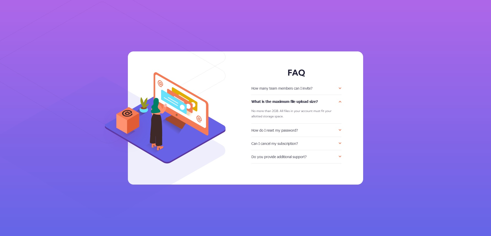

# Frontend Mentor - FAQ accordion card solution

This is a solution to the [FAQ accordion card challenge on Frontend Mentor](https://www.frontendmentor.io/challenges/faq-accordion-card-XlyjD0Oam). Frontend Mentor challenges help you improve your coding skills by building realistic projects. 

## Table of contents

- [Overview](#overview)
  - [The challenge](#the-challenge)
  - [Screenshot](#screenshot)
  - [Links](#links)
- [My process](#my-process)
  - [Built with](#built-with)
  - [What I learned](#what-i-learned)
  - [Continued development](#continued-development)
  - [Useful resources](#useful-resources)
- [Author](#author)

## Overview

### The challenge

Users should be able to:

- View the optimal layout for the component depending on their device's screen size
- See hover states for all interactive elements on the page
- Hide/Show the answer to a question when the question is clicked

### Screenshot



### Links

- Solution URL: [https://github.com/noclipdog/FAQ-Accordion-Component](https://github.com/noclipdog/FAQ-Accordion-Component)
- Live Site URL: [https://noclipdog.github.io/FAQ-Accordion-Component/](https://noclipdog.github.io/FAQ-Accordion-Component/)

## My process

### Built with

- Semantic HTML5 markup
- CSS custom properties
- Flexbox
- Mobile-first workflow

### What I learned

Learned some basic JavaScript in order to make a functional accordion. Used a W3Schools template which I modified in order to toggle the active state on both accordion and panel elements:

```js
var acc = document.getElementsByClassName("faq-accordion");
var i;

for (i = 0; i < acc.length; i++) {
  acc[i].addEventListener("click", function() {
    this.classList.toggle("active");

    /* nextElementSibling should be faq-panel */ 
    var panel = this.nextElementSibling; 
    if (panel.style.display === "block") {
      panel.style.display = "none";
      panel.classList.toggle("active");
    } else {
      panel.style.display = "block";
      panel.classList.toggle("active");
    }
  });
} 
```
In the future I want to come back and add some transitions.

Overall, good first JS exercise.

Practiced some positioning in order to get the images to achieve the desired result. Used 'position: absolute' and other position-related attributes. Here's an example:

```html
<header class="desktop-header">
  
  
  
</header>
```

```css
.desktop-header{
    display: none;
    position: absolute;
    left: -90px;
    z-index: 1;
}

.desktop-box{
    position: absolute;
    top: 135px;
    left: -6px;
}

.desktop-image-shadow{
    position: absolute;
    width: 200%;
    top: -350px;
    right: 0;
    z-index: -1;

}
```

### Continued development

I feel my HTML and CSS foundations are good enough to dive right into JavaScript projects. I'll make 2-3 Newbie JS challenges before going into Junior challenges.

I also want to write better markups, but that's not a priority right now.

### Useful resources

- [How to create an Accordion](https://www.w3schools.com/howto/howto_js_accordion.asp) - This helped me with the JS code.

## Author

- Website - [NoClipDog](https://www.your-site.com)
- Frontend Mentor - [@noclipdog](https://www.frontendmentor.io/profile/noclipdog)